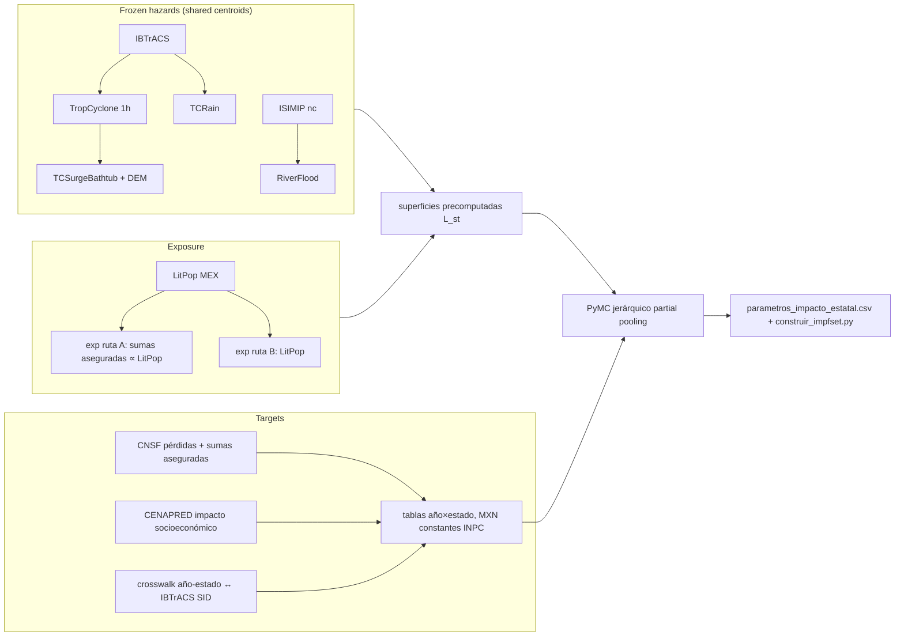

# impactcal-mx

**Subnational (state-level) CLIMADA impact-function calibration for Mexico** — hydrometeorological
perils (ciclón: viento + marejada + lluvia; inundación fluvial) — calibrated against CNSF insured
losses (ruta A) and CENAPRED total losses (ruta B) with a hierarchical Bayesian (partial-pooling)
model over precomputed CLIMADA loss surfaces.

Standalone working branch related to the `climateCCR` thesis project (merge open — `OQ-CAL-12`).
**Single source of truth:** the context canon in [`context/`](context/00_README_CONTEXT.md).
**Full design:** [`notes/theory/Calibracion_Impacto_Mexico_Master.md`](notes/theory/Calibracion_Impacto_Mexico_Master.md).

## Pipeline



## Setup (drop-in on a new machine)

```bash
cd impactcal-mx
git init && git add -A && git commit -m "bootstrap: canon + infra + vault (CAL-GEN-01..12)"
conda env create -f environment.yml && conda activate impactcal
pytest                                  # infra layer must be green
pre-commit install
conda env export --no-builds > environment.lock.yml && git add environment.lock.yml \
  && git commit -m "CAL-GEN-05: lock environment"
```

Then: open the folder as an **Obsidian vault** (see `OBSIDIAN_SETUP.md`) and launch **Claude
Code at the repo root** (`CLAUDE.md` is read each session; start with `/warmstart`).

Bulk data outside the repo? `export IMPACTCAL_DATA_ROOT=/path/to/data` (see `CAL-GEN-06`).

## Status & next steps

Sequence (master doc §10): **1. crosswalk ✅ v1** (hazard-side, `CAL-XWALK-03/04`) →
**2. timestep ✅ 0.5 h** (`CAL-WIND-02`, [[timestep-convergence-test]]) → **hazards ✅ frozen**
(four perils on the shared grid, `DC-CAL-HAZ-1`; RF gap 2011–2015 = GloFAS compute,
`OQ-CAL-17`) → **3. exposures ✅** (`CAL-EXP-04`) → **4. target tables** (← current; source
frozen, `CAL-TARGET-04`) → 5. national null model (`climada.util.calibrate`) →
6. precomputed surfaces → PyMC hierarchical (wind) → 7. multi-peril joint → 8. fluvial →
9. validation → export.

## Related
[[_INDEX]] · [[00_README_CONTEXT]] · [[CAL_MOC]]
#arm/cal #type/readme
